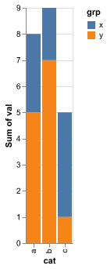
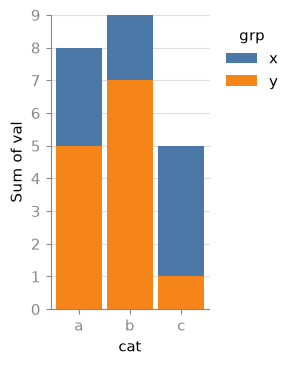
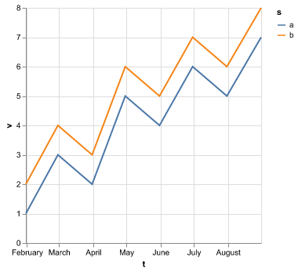
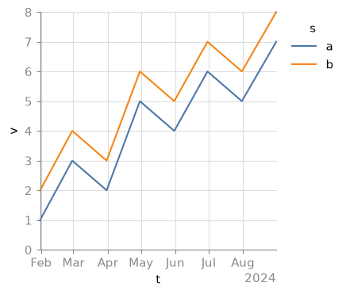
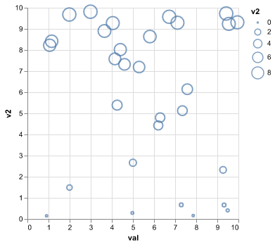
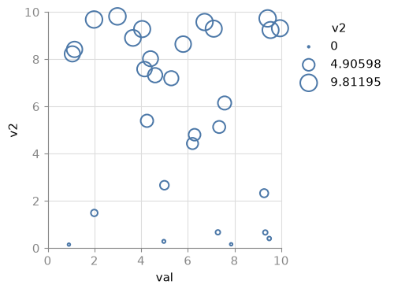
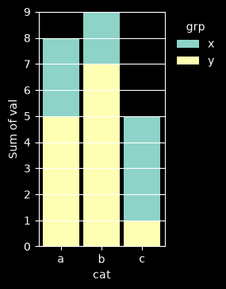

# mpl-altair

A prototype native matplotlib backend for [Altair](https://altair-viz.github.io/). It renders Altair charts as real matplotlib `Figure`/`Axes` objects, not as an image copy of Vega-Lite's own renderer. That means a chart from mpl-altair is a genuine matplotlib plot: you can theme it with any mpl style, embed it in a subplot grid next to other matplotlib plots, or export it through any matplotlib backend (PDF, SVG, PGF/LaTeX, and so on).

## Examples

Each pair shows the same Altair chart rendered by Vega-Lite's own renderer (left) and by mpl-altair (right). The goal is a semantic match, not a pixel match, so tick placement and label formatting differ where matplotlib's own conventions apply.

| Altair (vl-convert) | mpl-altair |
| --- | --- |
|  |  |
|  |  |
|  |  |

Because the output is a real matplotlib figure, any matplotlib style restyles the whole chart. This is the same stacked bar converted with `style="dark_background"`:



## How it works

Altair charts are specified in Vega-Lite, a high-level grammar of graphics. mpl-altair does not reimplement Vega-Lite's semantics. Instead it reuses the real Vega-Lite compiler and the real Vega dataflow engine to do all the hard work, and only translates the fully resolved result into matplotlib calls:

```
Altair chart (chart.to_dict())
  -> vl-convert: Vega-Lite spec -> Vega spec       (compiles all VL semantics/defaults)
  -> vegafusion: pre_transform_spec()               (evaluates transforms, inlines data)
  -> mpl-altair: reads the resolved scales/marks/axes/legends
  -> matplotlib calls, in data coordinates          (mpl owns axes, ticks, legends, layout)
```

This is why mpl-altair can support most standard Altair chart types without reimplementing Vega-Lite's scale, stacking, and binning logic from scratch: by the time mpl-altair sees the spec, vl-convert and vegafusion have already resolved it down to concrete rows, scale domains, and per-mark encodings. mpl-altair's job is just to walk that resolved structure and call the matching matplotlib function (`ax.bar`, `ax.scatter`, `ax.plot`, and so on).

## Philosophy

**matplotlib owns the axes, ticks, legends, and styling. mpl-altair does not chase pixel-for-pixel fidelity with Vega-Lite's own renderer.**

Concretely:

- Positions and data extents come from Vega-Lite's resolved scale domains, but tick placement, tick formatting, gridlines, and legend layout are matplotlib's own (`AutoLocator`, `ConciseDateFormatter`, `ax.legend`, `fig.colorbar`, and so on).
- Colors follow matplotlib style, not Vega-Lite's rendering. A categorical color scale pulls from the active mpl `prop_cycle`; a continuous color scale pulls from `rcParams['image.cmap']`; Vega-Lite's compiled-in default mark color resolves to mpl's `'C0'` so a plain, uncolored bar or point chart also restyles with the active mpl style.
- The goal is a **semantic match**: same data extents, same categories, same stacking order, same legend content, same colors-per-series. Not a pixel match against Vega-Lite's SVG/canvas renderer.

If you want the classic Vega-Lite look, that's the default (`mplaltair` ships a `vega-lite` mpl style sheet, applied automatically). If you want your own house style, pass any matplotlib style name or your own style sheet, or use `style=None` to inherit whatever mpl style is already active in your session.

## Quickstart

```python
import altair as alt
import pandas as pd
import mplaltair

df = pd.DataFrame({"cat": ["a", "b", "c"], "val": [3, 7, 5]})
chart = alt.Chart(df).mark_bar().encode(x="cat:N", y="val:Q")

fig = mplaltair.convert(chart)
fig.savefig("bar.png")
```

`convert()` also accepts a raw Vega-Lite spec dict, an `ax=` to draw into (for embedding in a subplot grid), and a `style=` kwarg:

```python
fig, (ax1, ax2) = plt.subplots(1, 2)
mplaltair.convert(chart1, ax=ax1)
mplaltair.convert(chart2, ax=ax2, style="dark_background")
```

- `style="vega-lite"` (default): mpl-altair's bundled Vega-Lite-ish style sheet.
- `style=None` or `style="none"`: no style context is applied; the chart uses whatever mpl style/rcParams are already active in your session.
- Anything else (`style="dark_background"`, `style="/path/to/my.mplstyle"`, ...): passed straight through to `plt.style.context(...)`.

### Using it as an Altair renderer

mpl-altair also registers itself as an Altair renderer, so `chart` objects display as matplotlib-rendered PNGs (for example, in a Jupyter notebook):

```python
import mplaltair
mplaltair.enable()

chart  # displays as a matplotlib PNG instead of the default Vega-Lite renderer
```

## Supported

- Marks: bar (simple, stacked, grouped), histogram (binned bar), point/circle/square (scatter), line (single and multi-series), area (stacked), tick, rule.
- Layered charts (multiple marks sharing one set of scales), through the same code path as a single mark, with no extra handling needed.
- Scales: linear, log, sqrt, time, band, point, ordinal/nominal.
- Encodings: x, y, color (categorical -> mpl prop cycle, continuous -> colormap + colorbar), size (scatter), shape is not yet implemented.
- Legends: categorical color/fill legends, continuous color colorbars, size legends (3-point proxy legend).
- `zero`/`nice` domain flags, `d3`-style binning, temporal axes with mpl's `ConciseDateFormatter`.

## Not supported (prototype scope)

- Faceting and `concat`/`hconcat`/`vconcat`.
- `geoshape`, `text`, and `arc` marks.
- Interactivity (selections, tooltips, pan/zoom).
- Independently-resolved dual-axis charts (`resolve_scale(y="independent")`) -- not handled; each scale/mark is walked independently with no special detection, so results are undefined rather than validated or rejected.
- Exact tick-format fidelity to Vega-Lite's `d3-format` strings (best-effort translation of trivial cases; mpl's own default formatting otherwise).
- `width: "container"` / other signal-driven, non-numeric dimensions.

Unsupported or unrecognized spec shapes raise a warning and skip the offending piece rather than silently guessing or crashing the whole render.

## Known issues

- **Boundary gridlines can still fail to render.** Gridlines at the axes limits sit exactly on the axes edge; despite unclipping them (`_guides.unclip_gridlines`, applied after the figure-resize pass), some charts still visibly miss the top/right-edge gridline that Vega-Lite always draws. The pixel-level regression test finds gridline-intensity pixels at the boundary, so what survives may be a faint sub-pixel remnant rather than a full-strength line. Root cause not fully run to ground; needs a deeper look at how mpl rasterizes 1px lines at the axes boundary (and whether tick objects get recreated with clipping after later draws, e.g. `bbox_inches='tight'` re-layout).

## Gallery

`scripts/gallery.py` renders about a dozen representative charts through both mpl-altair and the reference `vl-convert` PNG renderer, side by side, into `scripts/out/gallery.html`, plus one extra row showing a chart re-themed with `style="dark_background"`. Run it and open the HTML file in a browser:

```bash
MPLBACKEND=Agg uv run python scripts/gallery.py
open scripts/out/gallery.html
```

## Tests

```bash
MPLBACKEND=Agg uv run pytest -q
```
